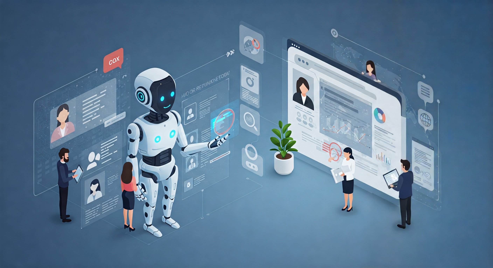
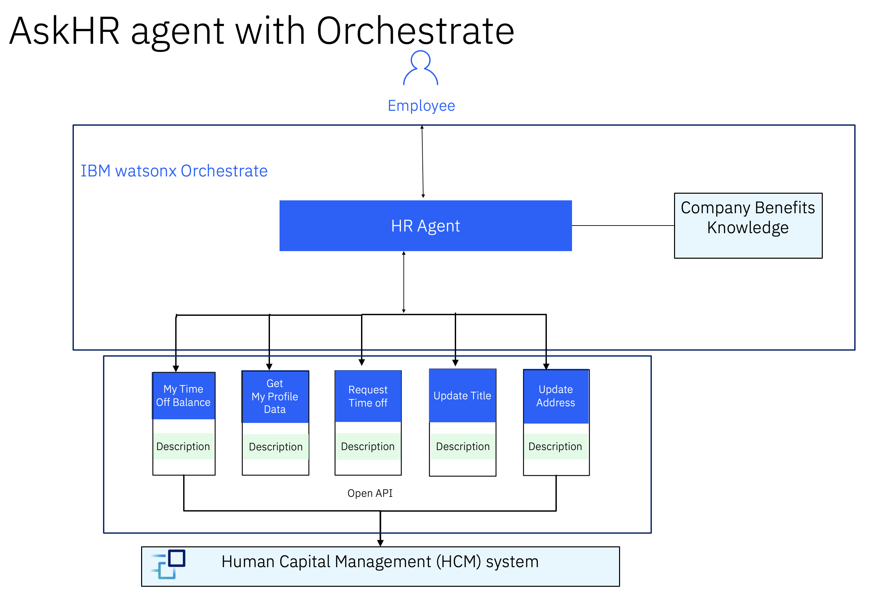

# 🧑‍💼 AskHR

One of the main challenges faced by any big organization is their HR operations management. As companies grow in size, it becomes increasingly difficult to get information faster and execute tasks with ease. With the advent of Agentic systems, and the power or reasoning models, it becomes easier to have a single entry point for doing mostly every HR operation.

## 🤔 The Problem

TechCorp Inc., a global IT leader with a workforce of 100,000 employees, faced a significant challenge in managing its growing HR operations. As the company expanded, it struggled with efficiently handling employee profile data, time-off requests, and workforce management. Traditional HR systems were no longer sufficient to keep up with the scale and complexity. With multiple vendor tools used for different HR operations, it is difficult to integrate all of them together and provide a seamless experience to the user.

## 🎯 Objective

With this use case, we are planning to tackle the challenge by adopting an enterprise-grade platform, watsonx, equipped with Agentic capabilities.
In this lab, we will see how the out-of-the-box prebuilt tools in watsonx Orchestrate can connect to HR management tools such as Workday, SuccessFactors, etc., or create custom tools to connect to any such systems easily. With agent driven insights, let's help TechCorp fast-track information retrieval, reduce administrative overhead, and ensure a more efficient and effective workforce.

## 📈 Business value

The usage of an AI-backed system to optimize the HR process can have multi-dimensional impacts, such as quicker resolution time, higher user satisfaction, increased revenue, and reduction in employee burnout, which ultimately positively impacts your business value. On the other hand, leveraging the Agentic capablities will come with its own additional set of values viz, improved data safety, and more grounded responses without hallucinations, thereby improving brand experience. 

## 🏛️ Architecture

To streamline employee interactions with HR systems, we have designed an AI-driven AskHR agent using IBM watsonx. This solution leverages a multi-agent orchestration model that ensures intelligent reasoning, seamless action execution, and a responsive experience for employees. The architecture is built with watsonx Orchestrate enabling the HR agent to manage a wide range of HR-related queries and requests efficiently.

#### Key capabilities of the AskHR agent:

1. Automates routine HR tasks like checking leave balance, requesting time off, and updating employee details.

2. Enables natural interaction between employees and backend HR systems through an intuitive app interface.

3. Uses reasoning and tools to fetch or update information securely and reliably.

4. Seamlessly integrates with internal systems using OpenAPI connectors.

5. This system leverages watsonx Orchestrate for coordination and advanced reasoning and web-based tasks, offering a comprehensive AI-powered HR support experience.

### Architecture Components

- **HR Agent and App (IBM watsonx Orchestrate)**: The HR agent acts as the central orchestrator, managing user interactions and delegating tasks to appropriate tools in the HR App.

It has a collection of reusable tools powered by OpenAPI and Company Benefits Knowledge documents. Each tool is designed to perform a specific HR-related task, such as:
Checking time-off balances
Submitting time-off requests
Updating personal details (business title, home address)

HR Agent retrieves relevant information from Company Benefits Knowledge documents to answer related queries

- **Human Capital Management (HCM) System**: The HR app communicates with the underlying HCM system to fetch or update employee data, ensuring real-time synchronization and accuracy.

## 🎥 Demo

https://github.ibm.com/skol/agentic-ai-client-bootcamp/assets/449286/ae5718a9-cc03-44f3-bd58-a9e3aa227271

> [!IMPORTANT]
> This lab uses a simulator for a Human Capital Management system. However, this could be easily changed to any real system running in production such as Workday or others.

## 📄 Hands-on step-by-step lab

Please find the step-by-step instructions [here](/usecases/ask-hr/assets/hands-on-lab-askHR.md) on how you can implement this use case.
