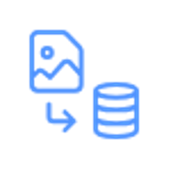

# HR Workflows Struggling to Get the Right Information to the Right Users in a Timely Manner

**Fragmented Systems and Tools**

Many organizations still use outdated or disconnected HR systems, causing data silos and inefficiencies. This fragmentation leads to difficulties in accessing accurate, up-to-date information, which impacts timely decision-making and workflow.

**Lack of Automation**

Despite technological advances, many HR tasks like onboarding, payroll, and time tracking remain manual, which is time-consuming and error-prone. Automating these processes can improve efficiency, reduce errors, and ensure timely actions.

**Slow Response Times**

HR teams often face delays in responding to employee queries about benefits, leave, or policies. Slow approvals and decision-making create bottlenecks, reducing overall efficiency.

**Inefficient Communication Channels**

Relying on outdated communication methods like email and paper forms slows many HR processes. The lack of centralized platforms for documents and updates leads to miscommunication, although modern HR software can help if adopted.

**Data Accuracy and Consistency**

Inconsistent or outdated employee data leads to confusion and delays. Without real-time tracking tools, HR professionals can't provide timely feedback or make informed decisions.

**Cybersecurity Threats**

Digital technologies and remote work expose HR data to increased cyber risks like breaches, phishing, and ransomware. A data breach could lead to reputational damage, legal issues, and financial losses, especially as HR systems contain personal employee information.

**Access Control Issues**

Proper access management is critical. Without strong role-based controls, sensitive data may be exposed to unauthorized users. HR systems need to ensure only authorized individuals can view or edit relevant information, which is complex for global or multi-department organizations.

**Compliance with Regulation**

HR must comply with data protection laws like GDPR, CCPA, and HIPAA. Failure to do so can result in severe penalties. HR departments must ensure data storage, consent, access, and audits align with these regulations.

**Secure Data Sharing**

Collaborating across departments often requires sharing sensitive data. Insecure file-sharing can lead to data breaches. Secure platforms and encryption are essential to protect data and ensure compliance.

**Data Retention and Deletion**

Many HR departments fail to follow strict data retention policies, leading to excessive storage or privacy violations. Automated systems are needed to enforce retention and deletion rules securely.

## Conclusion
HR departments face two critical business challenges that affect organizational performance: inefficient workflows and inadequate control over sensitive data. The need for streamlined processes to deliver the right information to the right people in a timely manner is essential to improving HR efficiency and employee satisfaction. At the same time, protecting sensitive employee data and ensuring it is accessible only to authorized users is essential for maintaining trust, compliance, and organizational integrity.

Addressing these challenges requires investment in modern HR technologies, robust data security measures, automation tools, and comprehensive training for HR personnel. By investing in these areas, departments can enhance their operations, reduce risks, and support the overall success of the organization.
