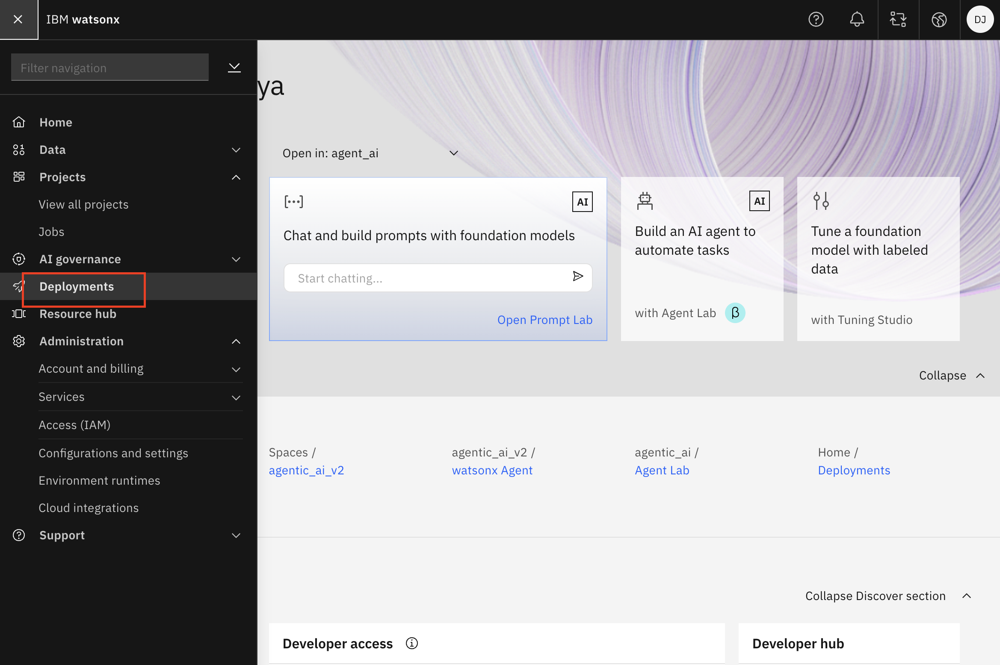
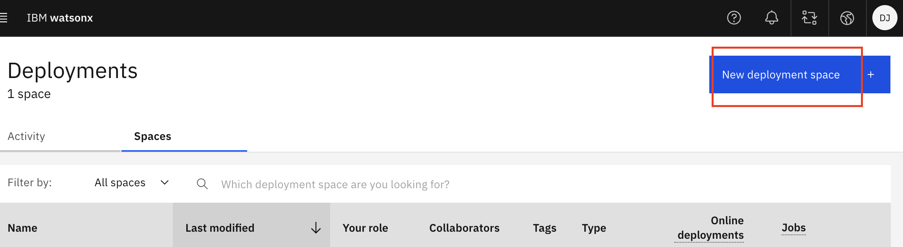
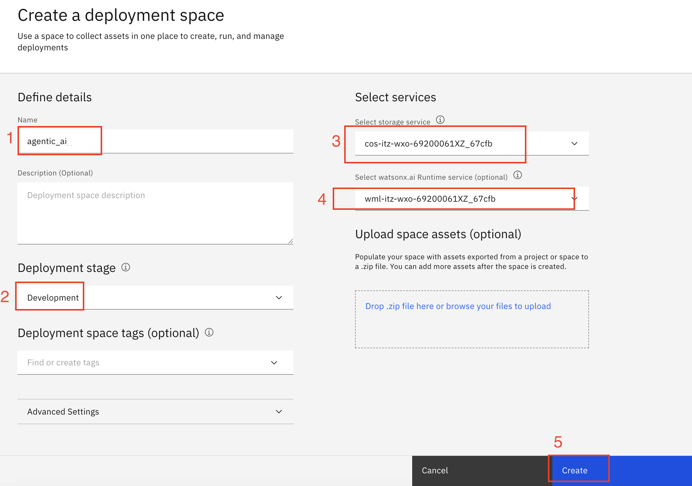
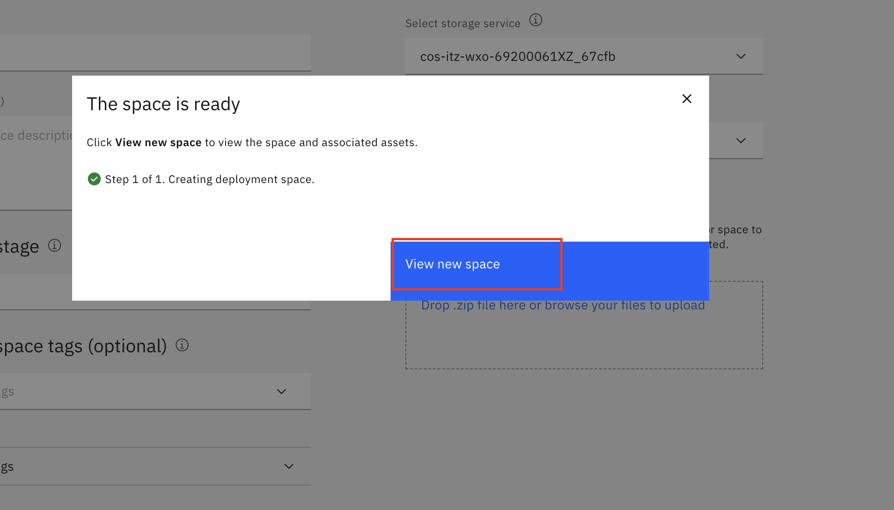

# Deployment Space Creation Guide

1. From the IBM watsonx homepage, navigate to the left-hand Menu and select the "Deployments" option.

2. Click the "New deployment space +" button.

3. Enter details like Name, Deployment stage (from drop-down), storage service (from drop-down) and watsonx.ai Runtime (from drop-down).
   Then, click the Create button.

4. Wait for the space to be ready. Once it's ready, you can see it by clicking on "View new space".

