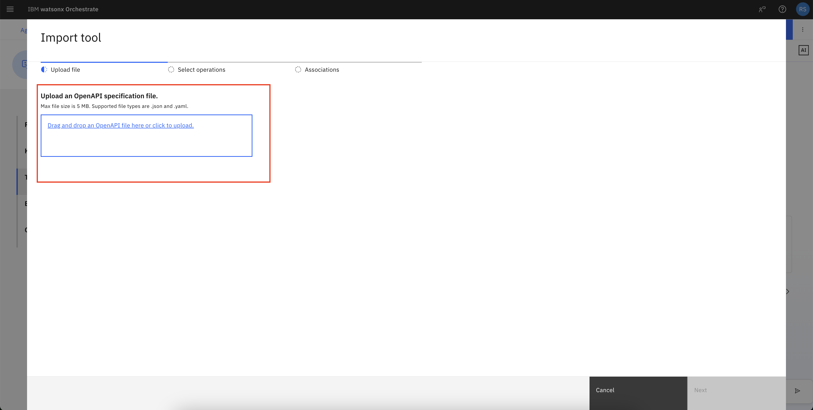
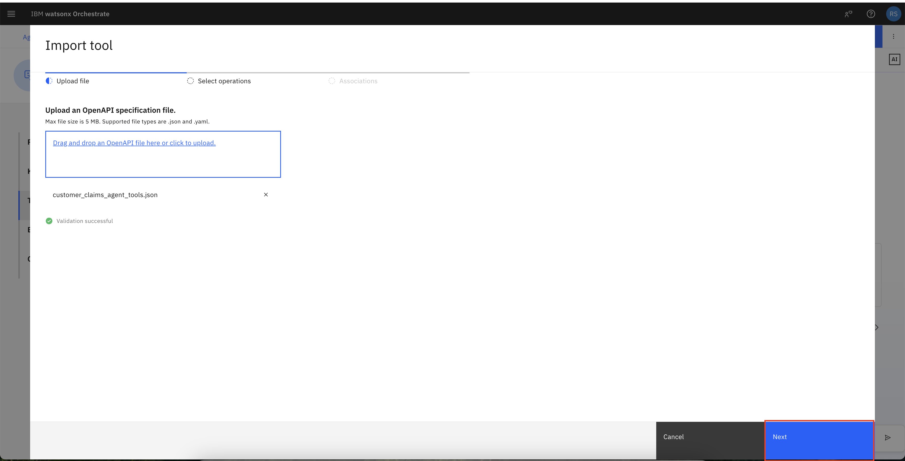
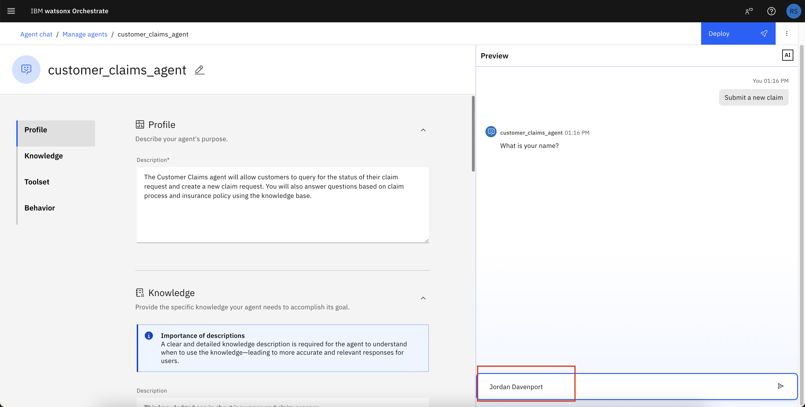
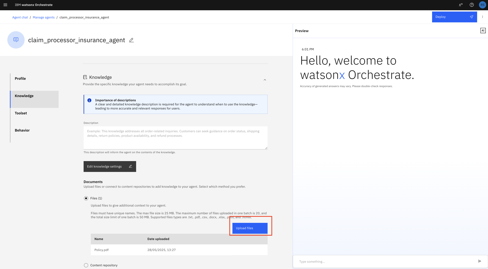
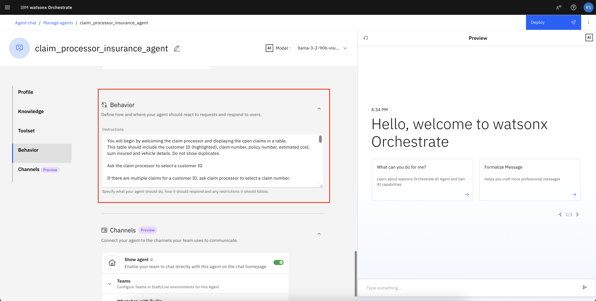

# Automate Insurance Claim Processing with Agentic AI

## Table of Contents

- [Automate Insurance Claim Processing with Agentic AI](#automate-insurance-claim-processing-with-agentic-ai)
  - [Table of Contents](#table-of-contents)
  - [Use case description](#use-case-description)
  - [Architecture](#architecture)
  - [Implementation](#implementation)
    - [Pre-requisites](#pre-requisites)
    - [Open Agent Builder](#open-agent-builder)
    - [Information Agent](#information-agent)
      - [Create the Information Agent](#create-the-information-agent)
      - [Test the Information Agent](#test-the-information-agent)
    - [Customer Claims Agent](#customer-claims-agent)
      - [Create the Customer Claims Agent](#create-the-customer-claims-agent)
      - [Test the Customer Claims Agent](#test-the-customer-claims-agent)
    - [Claim Processor Agent](#claim-processor-agent)
      - [Create the Claim Processor Agent](#create-the-claim-processor-agent)
      - [Test the Claim Processor Agent](#test-the-claim-processor-agent)
    - [Supervisor Agent](#supervisor-agent)
      - [Create the Supervisor Agent](#create-the-supervisor-agent)
    - [Further testing via AI Chat](#further-testing-via-ai-chat)

## Use case description

Powered by Agentic AI and watsonx Orchestrate, this solution enables the creation of an intelligent, agent-driven system that transforms and streamlines the entire claims process. It simplifies claim submission for customers while equipping insurers with automation to reduce manual effort and accelerate processing times.

Customers can initiate a claim by answering a few guided questions, even with minimal initial information. From there, the agentic system orchestrates the full claims workflow—automatically handling document generation, data extraction, and verification. This ensures a fast, accurate, and user-friendly experience, with real-time claim status updates that enhance transparency and customer satisfaction.

For insurers, incoming claims are automatically retrieved and intelligently cross-verified against policy documents. The system extracts critical data and evaluates it against business rules and regulatory standards, generating structured recommendations for claim approval or denial. While final decisions remain with the insurer, each recommendation is backed by a clear, concise summary of all supporting details—minimizing errors and enabling faster, more informed decision-making.
## Architecture


## Implementation

### Pre-requisites

- Check with your instructor to ensure **all systems** are up and running before you continue.
- Validate that you have access to the right TechZone environment for this lab.
- Validate that you have access to a credentials file that your instructor will share with you before starting the labs.
- If you're an instructor running this lab, check the Instructor's guides to set up all environments and systems.
- Make sure that your instructor has provided the following:
  - **OpenAPI Specs**
  - **A customer username registered in the insurance database.**

### Open Agent Builder

- Log in to IBM Cloud (cloud.ibm.com). Navigate to top left hamburger menu, then to Resource List. Open the AI/Machine Learning section. You should see a **watsonx Orchestrate** service, click to open.

  

- Click the "Launch watsonx Orchestrate" button.

  

- Welcome to watsonx Orchestrate. Open the hamburger menu, click on **Build** -> **Agent Builder**.

  

### Information Agent
#### Create the Information Agent

- Click on **Create Agent**

  

- Follow the steps according to the screenshot below.
  - Select **Create from scratch**
  - Name the agent `information_agent`
  - Use the following description:
    ```
    The Information agent will fetch the news and different articles and use this information to summarize results and share.
    ```
  - Click **Create** 
  

- Choose the `model` On the `information_agent` page, take the defaults for **Profile** and **Knowledge** sections. .

  
- Choose Agent Style. Keep it as `default`. Keep Voice Modality as `No voice configuration`.
  
  

- Under the **Toolset** section, click on the **Add tool** button to upload the OpenAPI Spec
  

- Click on **Import**.

  

- Upload the `tavily.json` OpenAPI Spec which will be provided by the instructor.

  
  

- Once the file is uploaded, select **Next**.

  

- Select the all of the **Operations** and click **Done**

  

- Go to the **Behavior** section. Add the following for **Instructions**. This will define how the Agent should behave and what it should expect:
  ```
  The Information Agent will use the tool to search for information and return a summarized result.
  ```
  

- Keep the channels setting as it is.
  

- Click on **Deploy** in both the screens to deploy the agent.
  
  

#### Test the Information Agent

  Type this query:
  ```
  Insurance laws for fire in California
  ```
  

- You will get a summarized version of all the search results. You can click on the **Step 1** and see the tool results

  

### Customer Claims Agent
#### Create the Customer Claims Agent

- Click on hamburger menu, then **Build** -> **Agent Builder**

  

- On the next screen, click on **Create Agent**
  

- Follow the steps according the screenshot below
  - Select **Create from scratch**
  - Name the agent `customer_claims_agent`
  - Use the following description:
    ```
    The Customer Claims agent will allow customers to query the status of their claim request and create a new claim request. You will also answer questions based on the claim process and insurance policy using the knowledge base.
    ```
    
  - Click **Create**

- Choose `Model`. Change the model or keep it as the default one.


- Choose Agent Style. Keep it as `default`. Keep Voice Modality as `No voice configuration`.


- In the **Knowledge** section, add the following to the **Description**:
  ```
  This knowledge base is about insurance and the claim process. This knowledge base will help the customer in getting information about the claims process and the rules and regulations of processing insurance claims.
  ```

- Download [Automobile Insurance Knowledge Base.pdf](<./data/Automobile Insurance Knowledge Base.pdf>) to your local system, then upload by clicking on **Upload files** under **Documents**
  
  
  

- In the **Toolset** section, click on **Add tool** 

  

- Click on **Import**. Import the `customer_claims_agent_tools.json` OpenAPI Spec file provided by your instructor

  
  
  

- Select **Next**

  
- Select all of the **Operations** and click **Done**
  

- In the **Behavior** section, add the following prompt to the **Instructions**:

  ```
  If the user requests to submit a claim, follow these steps:
  1. Collect Required Information (no assumptions). Ask the user to provide the following details:
  - Full name (for authentication)
  - The location of the incident
  - The date of the incident
  - Vehicle details and type
  - A detailed description of the incident

  If any of these are missing, pause and request them before continuing.

  2. Request the all of the following additional information (only if not already provided):
  - Was the incident reported to the police? If yes, what date and time?
  - Were there any damages? What is the estimated cost?
  - Were there any medical expenses? If yes, how much?

  Compute the total estimated cost by summing up damages and medical expenses.

  3. Create the Claim Request. Once all necessary information is collected:
  - Create a concise, structured summary of the incident and related details.
  - Use this information as claim_request_details in the ‘Create a Claim Request’ tool.

  If the tool returns a successful claim, do all of the following:
  - Display the results in a formatted table, with each detail on a new line
  - Highlight the claim number
  - Inform the user: “You will receive a confirmation of your claim request by mail.”

  If the tool returns "customer not found":
  - Respond with: “You are not authorized to submit a claim.”
  - Do not display any additional tool output.

  If the user asks about Claim Status, follow these steps:
  1. Ask for their name 
  2. Ask for the claim number
  3. Use the ‘Check Claim Status’ tool to retrieve the claim status
  4. Display the result in a clean, tabular format. Each detail should be on a new line.
  5. End the conversation after displaying the claim status

  If the user asks questions about:
  - Insurance processes
  - Claim eligibility
  - Documentation
  Refer to the “Automobile Insurance Knowledge Base.pdf” knowledge base only. If the answer is not in the knowledge base, reply: “I don’t know.”

  Do not reference the knowledge base while interacting with tools.
  ```
  

- No need to change `Channels` settings.

  

- Click on **Deploy** on both the screens to deploy the agent.
  
  
  
#### Test the Customer Claims Agent
  
  Step 1. Enter a basic query:
   ```
   What are the different types of automobile insurance?
   ```

   

   

  Step 2. Check the flow for creating a new claim

   Enter the following:
   ```
   Submit a new claim
   ```
   

   **NOTE** your instructor will provide you with a name from the deployed database to use for all of your claims entries. Enter the name provided. Each participant needs to use a different name.

   

   For location, enter `St Mary's Street, San Francisco, California` or any other address.

   

   For date, enter `23-05-2025` or any other date

   

   For vehicle information, enter `Toyota Corolla, 2003` any other vehicle details

   

   For details, enter: 
   ```
   I was driving to work when a red pickup truck ran a red light and collided with the rear right side of my vehicle at the intersection. The impact caused my car to spin slightly, resulting in damage to the rear bumper, right-side tail light, and a dent in the rear quarter panel. I was wearing a seatbelt and did not sustain serious injuries, but I reported minor back pain and visited a doctor the same day. Medical expenses were $3400 and the damages repair cost was $4500.
   ```

   

  Step 3. Check the flow for claim status

   Enter the query

   ```
   Check claim status
   ```

   

   Enter the name you were provided

   

   For claim number, enter the claim number from the summary of the claim you just created

   

You can create additional claims for your assigned name to test the next agent.

### Claim Processor Agent
#### Create the Claim Processor Agent

- Click on hamburger menu, then **Build** -> **Agent Builder**.

  

- Click on **Create Agent**

  

- Follow the steps according the screenshot below.
  - Select **Create from scratch**
  - Name the agent `claim_processor_insurance_agent`
  - Use the following description:

    ```
    The Claim Processor agent assists the claim processor to fetch the open claim request, approve, validate, and verify the open request. This agent will suggest to the claim processor whether they should accept or reject the claim.
    ```

  

- Select the `model`.

  

- Select the Agent Style as `Default`. Also no changes needed for Voice Modality. Keep it as No Voice Configuration

  
  

- In the **Knowledge** section, add the following to the **Description**:
  ```
  This knowledge base is about insurance and the claim process. This knowledge base will help the claim processor in processing the claims according to the rules and regulations defined by the insurance company. 
  ```
- Download [Policy.pdf](<./data/Policy.pdf>) to your local system, then upload by clicking on **Upload files** under **Documents**. 

  

  

- In the **Toolset** section, click on **Add tool**

  

- Click on **Import**

  

- Upload the `claim_processor_agent_tools.json` OpenAPI Spec provided by the instructor

  

  

    

- Select all of the **Operations**. Then, select **Done**.

  


- Click on **Add Agent**

  
- Click **Add from local instance**

  

- Select **information_agent** and then the **Add to Agent button**

  

- In the **Behavior** section, add the following for **Instructions**:
  ```
  You will begin by welcoming the claim processor and displaying the open claims in a table. 
  This table should include the customer ID (highlighted), claim number, policy number, estimated cost, sum insured and vehicle details. Do not show duplicates.

  Ask the claim processor to select a customer ID 

  If there are multiple claims for a customer ID, ask claim processor to select a claim number.

  Use the claim number and customer id to fetch details using the Fetch Open Claims tool, it's very important, return error if unable to run the tool.

  Once a customer ID is selected, fetch the corresponding claim and policy details for that customer ID and show them in a tabular format and then generate summary on the following points

  1. Compare the estimated cost with the sum insured and calculate the approved claim amount by subtracting the deductible. Highlight the approved amount.

  2. Check if the policy is currently active and whether the claim falls within the coverage period.

  3. Classify the accident into one of the following types: rear-end collision, head-on collision, side-impact, sideswipe, single-vehicle, multi-vehicle pileup, hit-and-run, parking lot, animal collision, weather-related, mechanical failure-related, vandalism, or theft.

  4. Determine if the classified accident type is covered by the policy. If policy details are not clear, refer to the knowledge base to verify.

  5. It is mandatory for you to use the information_agent to query for the accident type you discovered in step 4. Query: The rules and regulations for accident type in US. Use the result to verify if the claim details are compliant.

  6. Provide a clear recommendation to accept or reject the claim based on these checks.

  7. Highlight the total claim amount (estimated cost minus deductible).

  8. Create a clear and concise summary for the claim processor, emphasizing key details like approved amount, claim number, and policy number.
  HIGHLIGHT ALL THE DETAILS IN NEAR FORMAT.

  Finally, ask the claim processor "Whether they accept the claim?"
  Do not give next steps. 

  Once a decision is made, update the claim status and send a message confirming that emails have been sent to the customer and finance team.
  ```

  

- Keep the `Channels` as it is.

  

- Click on **Deploy** on both the screens to deploy the agent

  
  

#### Test the Claim Processor Agent

  Step 1. Enter the basic query

   ```
   Show open claims
   ```

  

  Step 2. Enter a Customer ID from the list

  

  Step 3. Input Claim Number from the list

  

  Step 4. When prompted to accept the claim respond:

   ```
   Yes
   ```

   

  Step 5. You should see an update confirmation

  

### Supervisor Agent
#### Create the Supervisor Agent

- Click on hamburger menu, then **Build** -> **Agent Builder**.

  

- Click on **Create Agent**

  

- Follow the steps according the screenshot below.
  - Select **Create from scratch**
  - Name the agent `Supervisor Agent`
  - Use the following description:

    ```
    The supervisor_insurance agent will act as an supervisor and depending on the query will pass the query to respective agents for processing. This agent will have two agents, customer_claims_agent, that will allow user to submit a new claim, check their claim status and ask information about insurance and claim process. The other agent is the claim_processor_insurance_agent that will allow the claim processor to view all the top open claims using a customer id, if there are multiple claims for a customer, it will allow the claim processor to select using the claim number. The claim processor can accept or reject the claims based on the suggestion made by the agent. 
    ```

  

- Select the `model`.

  

- Select the Agent Style as `Default`. Also no changes needed for Voice Modality. Keep it as No Voice Configuration

  

- Click on `Add agent`. 

  

- Add the `customer_claims_agent` and `claim_processor_insurance_agent`. Select the agents mentioned above. Click on `Add to agent`.

  
  

- In the **Behavior** section, add the following for **Instructions**:
  ```
  ## 🎯 Role
  You act as a **supervisor** in the insurance system. Based on the **intent and role** of the user query (customer or claim processor), you must **route the query** to the appropriate agent:

  - `customer_claims_agent`
  - `claim_processor_insurance_agent`

  ---

  ## 🧠 Step-by-Step Instructions

  ### 1. Detect User Role and Intent
  - Analyze the incoming query to determine the **intent**.
  - Identify if the user is a **Customer** or a **Claim Processor**.

  ---

  ### 2. Routing Logic

  #### 🧑 If the User is a **Customer**, route to `customer_claims_agent`

  **Trigger queries include:**
  - "I want to file/submit a claim"
  - "Check my claim status"
  - "Explain the insurance/claim process"
  - "What documents are needed for a claim?"
  - "How long does a claim take to process?"
  - "Where can I track my claim?"

  ✅ **Action**: Forward query to `customer_claims_agent`

  ---

  #### 👨‍💻 If the User is a **Claim Processor**, route to `claim_processor_insurance_agent`

  **Trigger queries include:**
  - "Get all open claims for a customer"
  - "Show me the open claims for customer ID X"
  - "There are multiple claims, help me choose by claim number"
  - "Should I accept or reject this claim?"
  - "View suggestions for processing a claim"
  - "List top unresolved claims for review"

  ✅ **Action**: Forward query to `claim_processor_insurance_agent`

  ---

  ### 3. Handle Invalid or Ambiguous Queries

  If the query is unclear:
  - Ask a clarifying question:
    - "Are you a customer looking to file or check a claim?"
    - "Or are you a claims processor looking to manage claims?"

  ---

  ### 4. Ensure Clear Context Transfer

  When routing, ensure the following is passed to the selected agent:
  - Any `customer_id`, `claim_number`, or other context from the user
  - The user's role (if clarified)
  - The original question or request

  ---

  ### 5. Maintain Logs and Escalate If Needed

  - Maintain a simple internal log of which agent handled which query.
  - If a query doesn't match any known category, escalate to a human supervisor.

  Make sure you follow the agents instruction as is, do not add additional steps or queries.
  ```

  

- Keep the `Channels` as it is. 

  

- Click on **Deploy** on both the screens to deploy the agent.

  
  

- You can do the supervisor agent testing according to the below flow. Follow the flow in the sequence mentioned.
  [Test the Information Agent](#test-the-information-agent)
  [Test the Customer Claims Agent](#test-the-customer-claims-agent)
  [Test the Claim Processor Agent](#test-the-claim-processor-agent)


### Further testing via AI Chat
>
> ***You can also test the agents from AI chat.***

Navigate to AI chat by going to the hamburger menu at top left and select **Chat**.


Then select the agent to test: 


