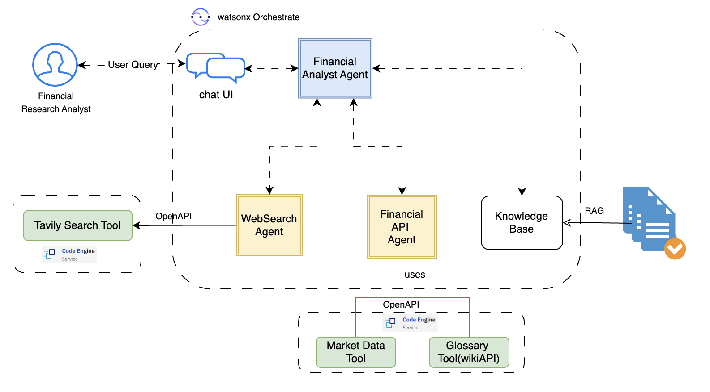

# 🥇 Financial Analyst Agent

## 🤔 The Problem

Blue Aurum Financial is looking to expand and scale their investments to deliver more value to their shareholders. However, their team of financial research analysts is struggling to identify new investment opportunities quickly due to the long time required in researching and performing due diligence for potential new investment opportunities. 

The process they follow is mostly manual requiring the financial research analyst to review financial reports for an entity of interest and compare with other entities in the same industry or where Blue Aurum Financial has already invested. After generating a comparative summary, the financial research analyst would then try to refine their perspective by performing online search to get details about the company, its management team, recent analyst reports, and recent news. They would also likely leverage internal financial modeling tools to forecast potential returns. 

To recap, some of the challenges faced by financial research analysts at Blue Aurum Financial include:

- Manual research leads to delays in identifying new investment opportunities.

- Research involves working with inernal tools for forecast modeling, performing external search against public data and reviewing/analyzing financial reports which requires significant manual effort.

- Market volatility and change in investor/analyst sentiment requires financial research analysts to continually iterate on their reviews, findings, and recommendations.

## 🎯 Objective

Blue Aurum Financial plans to implement an AI-powered Financial Research Agent to support their team of financial research analysts in accelerating their research and producing high value investment opportunities. The goal is to create an AI-powered agentic solutions that supports financial research analysts in executing the following tasks:

* Parse financial reports and extract key information.
* Provide comparative analysis between different entities based on their financial reports.
* Search public information for details about an entity as well as recent news and analysts reports.
* Execute internal tools for retrieving financial metrics via APIs.
* Generate a report of the findings and analysis.

By automating these tasks, the company aims to accelerate research process to identify new opportunities for investment.

## 📈 Business Value

* Reduction in manual research time.
* Automated, real-time updates on market information including recent news, market data, and analyst reports.
* Improved recommendations based on due diligence and automated research.

## 🏛 Architecture

To streamline the research process, Blue Aurum Financial partnered with IBM to design a Multi-Agent Financial Research solution powered by [watsonx Orchestrate](https://www.ibm.com/products/watsonx-orchestrate). The architecture below illustrate the various AI agents involved as well as the tools they leverage in executing their tasks. 

The architecture consists of specialized AI agents working together to perform key functions:
  * Web Search Agent skilled at executing web search queries and retrieving recent up to date information. The Web Search Agent is designed to execute a web search for public information using multiple search tools, namely, DuckDuckGo and Brave, and aggregate results to deliver a coherent complete response.
  * Financial API Agent skilled in retrieving information using Glossary Tool (to explain certain financial terms) and a Market Data Tool to return recent market data. In this bootcamp, we leverage a Market Data Tool to illustrate how the agent can leverage that tool to retrieve market data. In practice, other tools can be added in a similar manner that could represent internal modeling tools which are exposed via an API so financial research analysts can model performance of an asset.
  * Financial Analyst Agent which is the main orchestrator agent that responds to queries from the financial research analysts. It is an intelligent agent that can reason based on input query and decide how best to response. It can leverage an internal knowledge base to respond to queries enabling the RAG (Retreival Augmented Generation) pattern or it can delegate to one of the other agents to best address the user queries.

This system harnesses the power of [watsonx Orchestrate](https://www.ibm.com/products/watsonx-orchestrate), IBM's no-code/low-code/pro-code product for developing agentic AI solutions, and [watsonx.ai](https://www.ibm.com/products/watsonx-ai), IBM's platform for hosting foundation models such as Large Language Models (LLMs) .

To recap, you will learn in this bootcamp how to utilize the capabilities of watsonx Orchestrate to develop multiple agents and associated tools in order to develop a financial resarch agent to help accelerate financial research. The agent is skilled at understanding knowledge documents (such as earnings reports), performing comparative analysis, searching the web for recent news, and retrieving market data, all to assist financial reseach analysts in finding relevant information quickly to make investment recommendations. 

## 📝 Step-by-step Hands-on Lab
You can find step-by-step instructions here :

[Step-by-step hands-on guide](hands-on-lab-banking.md)

